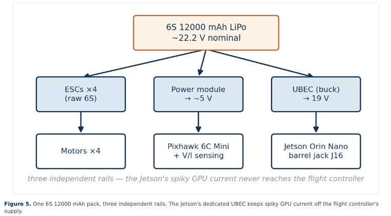
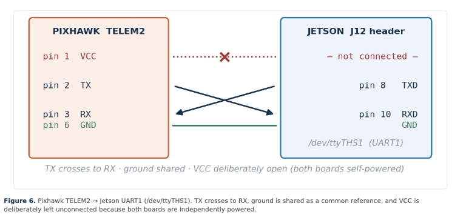

# Hardware Bring-Up and Electrical Integration

## Overview

This document records the physical hardware stack of Prototype 1-α, the steps required to bring the Pixhawk 6C Mini and Jetson Orin Nano into a working state, the power architecture, the serial link between the two computers, the mechanical mount plate, and the remaining physical tasks that stand between the current configuration and a corrected centreline-tracking outdoor flight.

## Airframe and Major Components

The airframe is a carbon-fibre quad-X. The flight controller is a Pixhawk 6C Mini mounted with an external GPS/compass mast. Propulsion is four motors driven by ESCs that speak DShot. Energy comes from a single 6S 12000 mAh pack. The companion computer is an NVIDIA Jetson Orin Nano 8 GB developer kit. The downward-facing camera is an Intel RealSense D455.

All of these components have been individually verified on the bench. The residual work is wiring the ESCs to the correct actuator outputs, confirming spin directions, obtaining outdoor GPS lock to clear the geofence pre-arm, moving the RealSense onto a true USB 3.x port, and a minor CAD revision of the mount plate.

## Pixhawk 6C Mini and PX4 1.17.0

The board was originally running ArduPilot 4.6.3 and was reflashed to PX4 1.17.0. Accelerometer, gyroscope, magnetometer and RC calibration were performed in QGroundControl. Flight modes and the hardware kill switch were assigned on an RC channel. Individual motors were driven from the Actuators panel with propellers removed, confirming that the outputs respond.

PX4’s internal architecture is a set of modules communicating over the uORB publish/subscribe bus. Sensors feed the EKF2 estimator; the commander state machine handles arming and failsafes; cascaded position/attitude/rate controllers produce torque and thrust demands that the mixer turns into per-motor DShot commands. The project never modifies this real-time core; it only sends high-level setpoints over MAVLink.

## Jetson Orin Nano

The Orin Nano was brought up with JetPack 6.x (L4T R36.3.0, Ubuntu 22.04.5). ROS 2 Humble, the RealSense driver, TensorFlow 2.15, and MAVSDK 2.8.4 were installed into a carefully pinned environment. The board runs the entire perception–planning–control graph and performs all neural-network inference. Its 8 GB memory ceiling directly constrained the choice of MobileNetV2 as the U-Net encoder.

## Power Architecture

*One 6S 12000 mAh pack, three independent rails. The Jetson’s dedicated UBEC keeps spiky GPU current off the flight controller’s supply.*

Everything on the aircraft ultimately draws from the single 6S pack. Three regulated rails supply the Pixhawk, the Jetson, and the camera. Careful attention was paid to ground loops and to ensuring that a brown-out on the companion computer cannot interrupt the flight controller’s power. The detailed schematic and connector pin-outs are recorded in the original progress report; the essential principle is that the flight-critical path remains powered even if the Jetson is deliberately powered down.

## Pixhawk ↔ Jetson Serial Link

*TELEM2 → UART1: TX crosses to RX, ground is shared, VCC is deliberately left open (both boards self-powered).*

In the flight configuration the Pixhawk’s TELEM2 port is wired to the Jetson’s UART1. MAVSDK connects with the URL `serial:///dev/ttyACM0:57600` (or the corresponding UART device). Bench verification confirmed that MAVSDK 2.8.4 can arm, take off (in simulation), and stream telemetry. The same link is used for both distributed SITL (over UDP) and real flight (over serial).

## RealSense D455

The camera publishes both RGB and depth. The current pipeline uses only RGB for segmentation, but depth remains available for future obstacle awareness. On USB 2.1 the camera is forced to 640×480 @ 15 fps; a true USB 3.x port is required to lift that bandwidth limit. Intrinsics have been measured on the real unit.

## Mechanical Mount Plate

A parametric OpenSCAD mount plate holds the Jetson, the Pixhawk, and the camera. A geometry conflict between a 3×3 cm side aperture and the Jetson pocket requires a small CAD revision; it is not a redesign of the load path.

## Remaining Physical Tasks

1. Wire the ESCs to the correct Pixhawk outputs and verify spin direction (props off).
2. Obtain outdoor GPS lock so that the “Fence requires position” pre-arm condition clears.
3. Move the RealSense to a USB 3.x port.
4. Apply the mount-plate CAD fix.
5. Perform the end-to-end serial-link verification in the final flight wiring harness.

Once these items are closed, the hardware side of Prototype 1-α is complete. All subsequent work is software validation and the confirmatory centreline-tracking flight.

## Related Documents

See `architecture.md` for the two-computer principle, `deployment.md` for the reproducible software image, and `safety.md` for the pilot-gate and failsafe logic that protect the physical aircraft.
